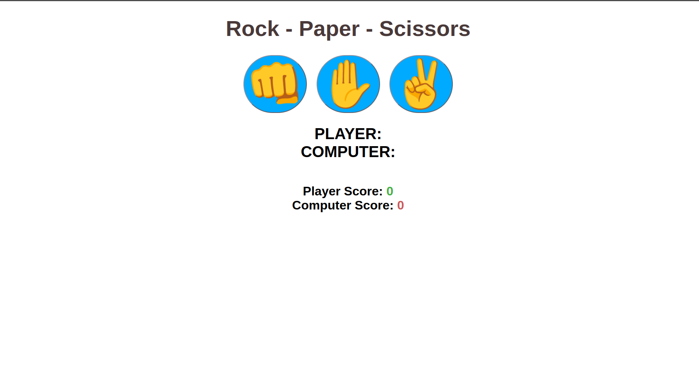
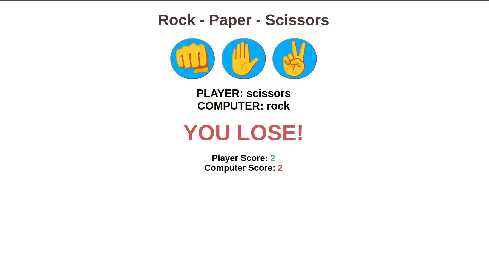
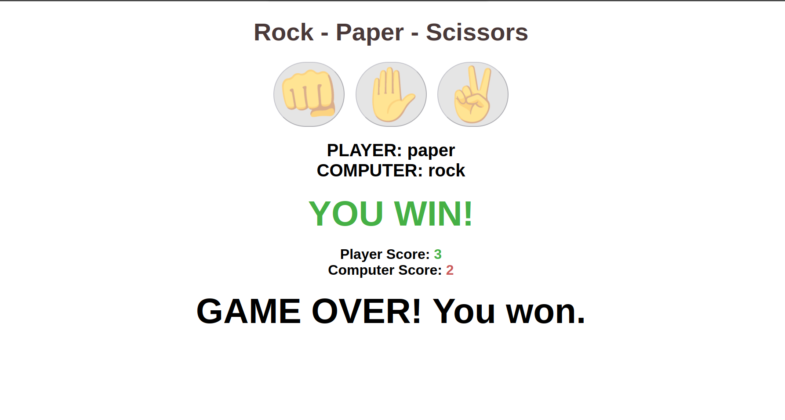

# Rock Paper Scissors game - The Odin Project

A classic Rock Paper Scissors game built with HTML, CSS, and JavaScript. This project was updated from a console-only version to a fully interactive web application with a UI, as part of The Odin Project curriculum.

***

## Screenshot

## Live Demo

You can play the game here: https://laym00n.github.io/odin-rock-paper-scissors/

## Technologies Used

1. HTML: For the structure and content of the game.

2. CSS: For all styling, including button hover effects, result colors (.greenText, .redText), and the :disabled button state.

3. JavaScript: For all game logic, including:

    * DOM Manipulation (selecting elements, updating .textContent, and
    managing classes).

    * Event Listeners (waiting for button clicks).

    * Game state management (tracking scores and rounds played).